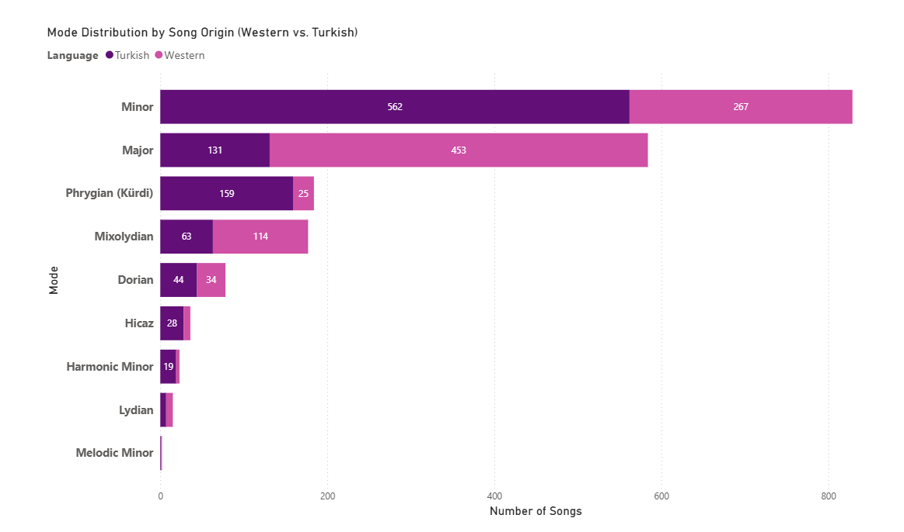

# HarmonAI — AI-Powered Harmonic Analysis System

HarmonAI is an AI-assisted system that performs automated musical harmony analysis starting from a YouTube link, artist name, and song title. It combines signal processing, music theory mathematics, web scraping, and large language models to produce a comprehensive harmonic report for any given song.

## What It Does

Given a YouTube link, artist name, and song title, HarmonAI:

- Downloads the audio and converts it to WAV
- Launches two independent parallel processes:
  - **Thread 1 — Audio Analysis:** Converts audio to MIDI (via Basic Pitch CNN), removes drum/percussion channels, then extracts key, mode, and chord sequence using cosine similarity and Pearson correlation
  - **Thread 2 — Web Scraping:** Retrieves chord data for the song from trusted tab/chord websites
- Merges both sources and generates a structured musicological report via Google Gemini

A fast analysis mode is also available (`fast_analyzer.py`) that bypasses MIDI conversion and works directly on the WAV file using librosa, reducing analysis time from ~90s to ~5-10s.

## System Architecture

```
[YouTube URL / WAV Path]
         |
         v
  [Audio Download]
         |
         |---> [Thread 1: Basic Pitch CNN]
         |             |
         |       [Drum Removal]
         |             |
         |       [Chroma Extraction]
         |             |
         |       [Key / Mode / Chord Detection]
         |
         |---> [Thread 2: Web Scraping]
                       |
                 [Chord Data]
                       |
                       v
               [Gemini LLM Report]
```

**Why ThreadPoolExecutor?**
- Web scraping is I/O-bound (waiting on network) — threads are ideal
- TensorFlow (Basic Pitch) releases the GIL during inference — parallel execution is possible
- Total time equals the duration of the longer task, not the sum — typical gain: 40-60 seconds

## Core Mathematics

| Component | Method |
|---|---|
| Chord detection | Cosine similarity against 108 chord templates (12 roots x 9 types) with Bayesian context bonus |
| Key / mode detection | Pearson correlation across 10 tonal profiles (Major, Minor, Harmonic Minor, Hicaz, Dorian, Phrygian, Mixolydian, Lydian, Locrian, Melodic Minor) with Z12 cyclic shift |
| Transition modeling | First-order 108x108 Markov transition matrices |
| Noise filtering | Dynamic threshold: chords below 5% relative frequency are excluded |

## Tech Stack

| Layer | Library |
|---|---|
| Audio download | `yt-dlp` |
| Audio / chroma analysis | `librosa` |
| MIDI conversion | `basic-pitch` (CNN), `pretty_midi` |
| Web scraping | `BeautifulSoup`, `Selenium`, `requests` |
| Mathematics | `numpy`, `scipy`, `scikit-learn` |
| Database | `sqlite3` (dataset.db) |
| LLM report | `google-genai` (Gemini 2.5 Flash) |
| Song list generation | `groq` (Llama 3.3 70B) |
| UI | `Streamlit` |

## Installation

```bash
git clone https://github.com/furkanaltas/harmonai.git
cd harmonai

pip install -r requirements.txt

cp .env.example .env
# Open .env and fill in your API keys
```

Required keys in `.env`:

```
GEMINI_API_KEY=...
GROQ_API_KEY=...
SPOTIPY_CLIENT_ID=...
SPOTIPY_CLIENT_SECRET=...
```

## Running

```bash
python -m streamlit run app.py
```

The browser interface opens automatically. Enter a YouTube link, artist name, and song title to start the analysis. Select "fast" mode for quick results (~10s) or "full" mode for MIDI-based analysis (~90s).

## Dataset Pipeline

HarmonAI includes an automated dataset builder that runs in the background:

```bash
# Build dataset continuously (target: 2000 songs)
python modules/auto_builder.py --simdi

# Single batch (25 Turkish + 25 Western)
python dataset_builder.py

# Label songs with Spotify ground truth
python modules/spotify_labeler.py
```

The pipeline: Groq generates a song list -> yt-dlp downloads audio -> Basic Pitch converts to MIDI -> drums are removed -> saved to `veri_seti/` and indexed in `dataset.db`.

## Project Structure

```
harmonai/
├── app.py                      # Streamlit UI
├── harmonai_pipeline.py        # Main pipeline (async + fast modes)
├── dataset_builder.py          # Automated MIDI dataset builder
├── modules/
│   ├── audio_core.py           # Audio download, MIDI conversion, tempo detection
│   ├── math_theory.py          # Chord templates, tonal profiles, detection functions
│   ├── fast_analyzer.py        # Librosa-based fast analysis (no MIDI)
│   ├── db_manager.py           # SQLite interface (songs + analyses tables)
│   ├── web_scraper.py          # Chord scraping from Turkish and Western sites
│   ├── llm_agent.py            # Gemini LLM report generation
│   ├── markov_models.py        # Markov transition matrix analysis
│   ├── auto_builder.py         # Background scheduler for dataset building
│   └── spotify_labeler.py      # Spotify API ground truth labeler
├── dataset.db                  # SQLite database (gitignored)
├── requirements.txt
├── .env.example
└── .gitignore
```

## Visualizations

A Power BI dashboard summarizing key/mode distribution across the
1,930-song dataset, comparing Western vs. Turkish repertoire — see
[`visualizations/`](visualizations/) for the full report and analysis.



Western-language songs skew Major (453 vs. 131 Turkish), while Turkish
songs skew Minor (562 vs. 267 Western) and carry nearly all of the
dataset's Phrygian (Kürdi) and Hicaz representation.

## Output Example

```
Key       : A Minor
Tempo     : 124 BPM
Chords    : Am · F · C · G · Em · Dm
Web       : Am · F · C · G

--- HarmonAI Report ---
This song is written in A minor. The chord progression follows a
diatonic pattern characteristic of Western tonal music...
```

## Author

**Furkan Altas** — Ege University, Department of Mathematics
Graduation thesis project, 2026
