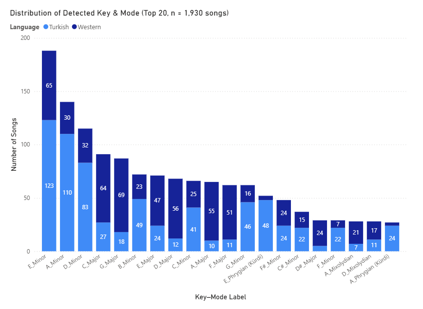
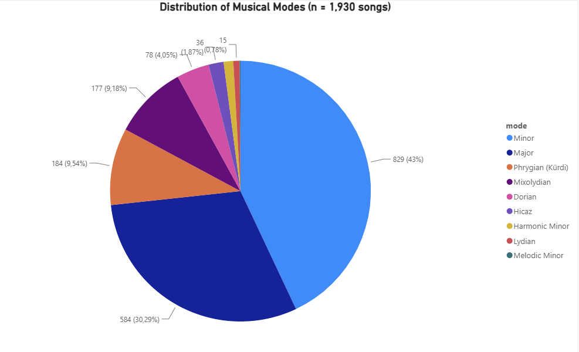

# HarmonAI Dataset Visualizations

Power BI dashboard summarizing the key/mode distribution across the
1,930-song HarmonAI dataset, with a Western vs. Turkish repertoire
comparison — the core empirical question behind the thesis project.

## Data source

Exported from the project's PostgreSQL `songs` table (`label` column,
self-labeled via `modules/midi_labeler.py`) and the `language` column
(`tr` = Turkish, `en` = Western/English repertoire).

## Charts

### 1. Mode Distribution by Song Origin (Western vs. Turkish)

Aggregated mode counts split by repertoire. This is the key comparative
finding: Western-language songs skew heavily **Major** (453 vs. 131
Turkish), while Turkish-language songs skew heavily **Minor** (562 vs.
267 Western) and carry nearly all of the dataset's **Phrygian (Kürdi)**
(159/184) and **Hicaz** (28/36) representation — a direct, visual
confirmation of the modal divergence the thesis investigates.

### 2. Distribution of Detected Key & Mode (Top 20)

The 20 most frequent key-mode combinations across the full dataset
(n = 1,930), split by repertoire. `E_Minor` and `A_Minor` dominate the
corpus; Turkish makams (Hicaz, Phrygian/Kürdi) appear almost
exclusively in the Turkish-language subset.

### 3. Distribution of Musical Modes (overall)

Overall mode proportions across the whole dataset, independent of
repertoire: Minor (43%), Major (30.29%), Phrygian/Kürdi (9.54%),
Mixolydian (9.18%), with Dorian, Hicaz, Harmonic Minor, Lydian, and
Melodic Minor each under 5%.

## Files

- `harmonai_dashboard.pbix` — full Power BI report (Power BI Desktop required to open/edit)
- `Image1.png`, `Image2.png`, `Image3.png` — static exports of the three charts above
